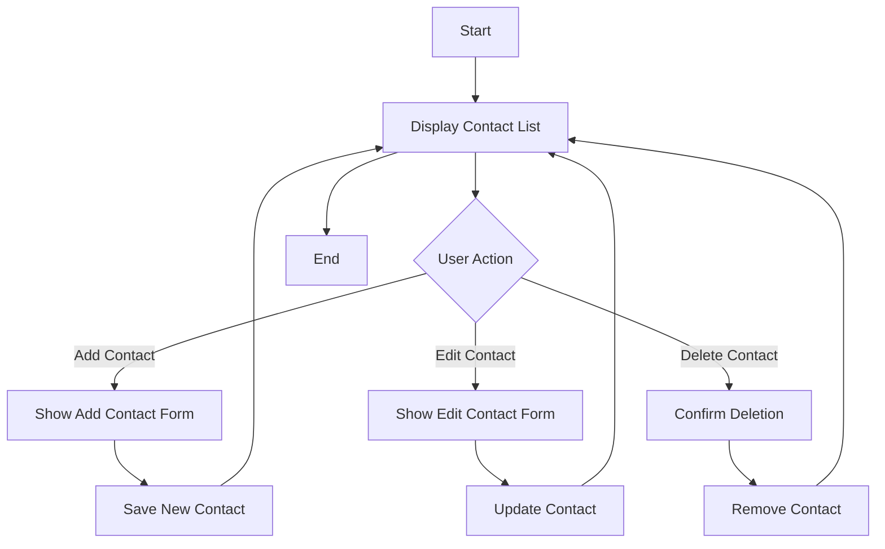

# 📒 Address Book

Proyek sederhana berbasis web untuk menyimpan dan mengelola daftar kontak.  
Dibuat menggunakan **HTML**, **CSS**, dan **Tailwind CSS** dengan tampilan yang responsif dan mudah digunakan.

## 🚀 Fitur
- Menambahkan, mengedit, dan menghapus data kontak  
- Desain responsif dengan Tailwind CSS  
- Tampilan bersih dan sederhana  

## 🛠️ Teknologi yang Digunakan
- HTML  
- CSS 
- JavaScript

## 📂 Flowchart
